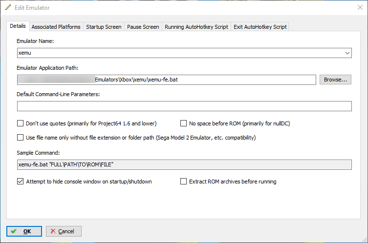

# xemu-fe
A script for automatically editing your xemu config for use with various Frontends. Your previous config will automatically be copied back once you close the emulator. This was made with LaunchBox in mind, but should work with any Frontend. Currently only a Windows script is available, though it could easily be adapted to BASH for use on Linux/Unix/MacOS.

## Guide
1. Download the latest release from [here](https://github.com/CakeLancelot/xemu-fe/releases/).
2. Extract the contents of the zip to your xemu folder. All three files (xemu-fe.bat, inittool.exe and camlrt.dll) should be present alongside xemu.exe
3. Create a new emulator in Launchbox (or whatever frontend you wish to use this with). Here is an example config for Launchbox:

4. That's it! Add some games to your Frontend and give it a try!
